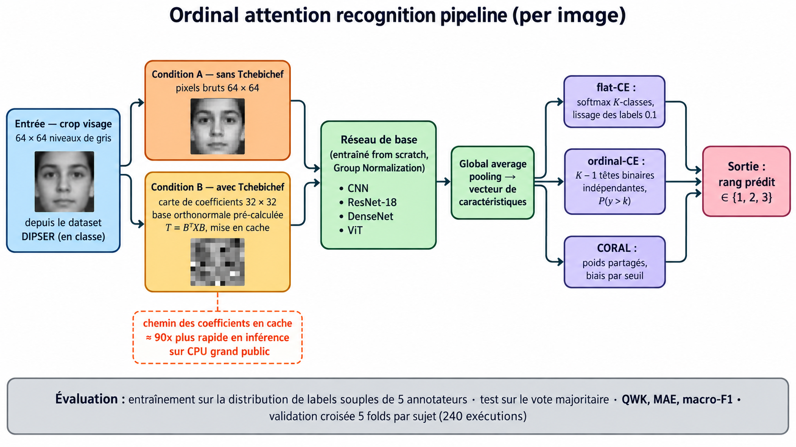

# gTAO-Net

**Gated Multimodal Ordinal Fusion for Attention Estimation in In-Person Classrooms**

gTAO-Net is a multimodal ordinal network for estimating student attention in real, in-person
classrooms. It fuses face, face-mesh, head-pose, and wrist-worn physiology streams into a
low-to-high attention judgment under a **sealed, pre-registered, ceiling-anchored protocol** on
[DIPSER](https://arxiv.org/abs/2502.20209), and re-runs the same protocol on two public webcam
engagement benchmarks — [DAiSEE](https://arxiv.org/abs/1609.01885) and
[EngageNet](https://dl.acm.org/doi/10.1145/3577190.3614164).

This work is **not a new state-of-the-art-QWK race**. It is a mechanistically instrumented
diagnosis of *why* unconditional multimodal fusion fails in classroom attention estimation:
a learned gate collapses to a frozen one-hot stream switch, a global link is confirmed as a
gradient highway, and no fusion configuration exceeds the best unimodal stream on any of the
three datasets.

---

## Quick facts

| Question | Answer |
|---|---|
| What | A gated multimodal ordinal fusion network + an instrumented factorial that localizes where each design axis helps, hurts, or is neutral |
| Datasets | DIPSER (in-person), DAiSEE and EngageNet (webcam) — all public |
| Protocol | GroupKFold by subject, 3 seeds, pooled-out-of-fold QWK, LORO ceiling, permuted-label shuffle control (`\|QWK\| ≤ 0.10`) |
| Experiment | 29 configurations × 5 folds × 3 seeds = **435 fits** on DIPSER (wall 3,601 s) + the same grid on DAiSEE + a disclosed scoped subset on EngageNet |
| Key result | **Fusion never beats the best unimodal stream**: +0.007 (DIPSER), +0.010 (DAiSEE), −0.194 (EngageNet) pooled QWK |
| Where it ran | Kaggle GPUs — kernels linked below |
| License | [MIT](./LICENSE) |

---

## Repository layout

```
gtao-net/
├── README.md                  ← you are here (entry point)
├── LICENSE                    MIT
├── CITATION.cff               citation metadata
├── assets/
│   └── architecture.png       Figure 1 (gTAO-Net overview)
├── kaggle/
│   ├── dipseer_grid/           DIPSER full-factorial kernel (notebook)
│   │   ├── gtao_grid.py        sealed grid: 29 configs, 435 fits
│   │   └── kernel-metadata.json
│   ├── daisee/                 DAiSEE 3-stream kernel (script)
│   │   ├── daisee-gtao.py
│   │   └── kernel-metadata.json
│   └── engagenet/              EngageNet scoped P2 kernel (script)
│       ├── engagenet-gtao-scoped.py
│       └── kernel-metadata.json
└── results/
    ├── DIPSER_grid_v1_metrics.json   325 config-seed rows (DIPSER)
    ├── DIPSER_h4_masked_eval.json    masked-eval probe (H4)
    ├── DAiSEE_metrics.json           P1 + P2 grids (DAiSEE)
    └── EngageNet_metrics.json        scoped P2 grid (EngageNet)
```

The scripts under `kaggle/` are **verbatim copies of the sealed kernels** that produced the
reported numbers — they are self-contained (dataset mount → protocol → metrics JSON) and
edited only to make `is_private: false`.

---

## Architecture



Each stream is encoded by a compact **discrete-orthogonal Tchebichef-moment** front-end, then
passed through a per-stream temporal tower. A **learned gate α** re-weights cross-modal
attention and is *permitted to annul a stream* (rejection, not just re-weighting). A linear
**global link** `G(x)` sums the inputs directly into the pre-head representation, guaranteeing
an unattenuated gradient path from the ordinal head back to the earliest layers. Three ordinal
objectives are compared: **CORAL** (ordinal threshold BCE), a CORE-style **hybrid** loss, and a
**soft** cumulative multi-rater target.

Four design axes are crossed in a `2 × 2 × 2 × 3` factorial:
fusion (`gate` vs `core`), global link (`ON`/`OFF`), modality dropout (`ON`/`OFF`), objective
(`coral` / `hybrid` / `soft`).

---

## Key results

### 1. The global link is a gradient highway ✅
- First-layer gradient norms grow **×12–×130** when the link exists (init probe; ×84 in the
  single-subject smoke run).
- The link's skip projections carry **×10²–10³** the tower gradient (ratio ×1209.8, seed 0, fold 0).
- Pooled-out-of-fold QWK improves in **11 of 12** configuration pairs across both fusion types and all objectives.

### 2. The gate collapses to a frozen one-hot stream switch ❌
- Gate trajectories α(e) are essentially one-hot from the first logged epoch and stay frozen;
  the *chosen* stream changes per fold (α = [0, 0, 1] → face-mesh on DIPSER seed 0; different
  corners on DAiSEE and EngageNet).
- Gated and non-gating fusion therefore become statistically indistinguishable (Δ = +0.007 on the best pair).

### 3. No fusion configuration exceeds the best unimodal stream ❌

| Setting | Best fusion (pooled QWK) | Best unimodal (pooled QWK) | Gap | Gate behavior | Shuffle control |
|---|---|---|---|---|---|
| **DIPSER** (in-person, 4 streams) | `gate_skip1_drop0_soft` 0.3492 ± 0.051 | `unimodal_facemesh` 0.3903 ± 0.024 | **+0.007** (≠ gain over best stream) | frozen one-hot per-fold switch | 0.057 ≤ 0.10 ✅ |
| **DAiSEE** (webcam, 3 streams) | `gate_skip0_drop0` 0.098 ± 0.008 (P2) | `unimodal_head_pose` 0.091 ± 0.007 | **+0.010** | collapse onto face (α ≈ 0.76) | 0.009 ≤ 0.10 ✅ |
| **EngageNet** (webcam, 3 streams) | `gate_skip1_drop0` 0.221 ± 0.012 | `unimodal_facemesh` 0.415 ± 0.005 | **−0.194** | frozen per-fold selector, stream switches per fold/seed | fit-level ≤ 0.011; pooled 0.021 ± 0.067 ✅ |

*(DAiSEE/EngageNet gaps are relative to the best unimodal of the same dataset; on DAiSEE the P1-official-split best is `gate_skip0_drop0` at 0.161 ± 0.009.)*

### 4. The load-bearing stream is dataset-specific
- **DIPSER:** face-mesh (0.390) ⊋ head pose ⊋ face.
- **DAiSEE:** head pose (0.091) > face (0.083) ≫ face-mesh (chance, −0.021).
- **EngageNet:** face-mesh (0.415) > head pose (0.375) > face (0.237) — face-mesh agrees with DIPSER, not DAiSEE.

### 5. A soft multi-rater target wins on fusion stacks
On DIPSER fusion configurations, the soft cumulative target consistently beats CORAL and the
CORE-hybrid loss — placing the previously contradictory ordinal-supervision results on one protocol.

> **Provenance & honesty notes.** The EngageNet run is a *disclosed scoped subset* of the sealed
> factorial (3 unimodals + focal gate/core link-ON pair + shuffle control, 6 configs × 3 seeds),
> chosen because the Kaggle `Train`/`Validation`/`Test` split is **not subject-disjoint**
> (85 + 88 subject recurrences), which makes the official-split anchor degenerate. DAiSEE runs
> the full grid. All numbers reproduce exactly across two independent GPU runs (DIPSER: 3,601 s
> vs 3,770 s, identical metrics).

---

## Reproducibility

### Run it on Kaggle (one click per benchmark)

| # | Kaggle kernel | Purpose | Status |
|---|---|---|---|
| 1 | [`gtao-net-grid-v1-full-factorial`](https://www.kaggle.com/code/zakariamakhas/gtao-net-grid-v1-full-factorial) | DIPSER — sealed full factorial (29 configs, 435 fits) | ✅ public |
| 2 | [`gtao-net-daisee-3-stream-benchmark-v1`](https://www.kaggle.com/code/zakariamakhas/gtao-net-daisee-3-stream-benchmark-v1) | DAiSEE — full grid, P1 + P2 | ✅ public |
| 3 | [`gtao-net-engagenet-scoped-p2-benchmark-v2`](https://www.kaggle.com/code/zakariamakhas/gtao-net-engagenet-scoped-p2-benchmark-v2) | EngageNet — scoped P2 grid | ✅ public |
| 4 | [`dipseer-gtao-net-smoke-single-subject-multimodal`](https://www.kaggle.com/code/zakariamakhas/dipseer-gtao-net-smoke-single-subject-multimodal) | Single-subject smoke run (cite α≈0.994 collapse) | ✅ public |

The kernel source + metadata in `kaggle/` is what you push:

```bash
kaggle kernels push -p kaggle/dipseer_grid   # DIPSER
kaggle kernels push -p kaggle/daisee         # DAiSEE
kaggle kernels push -p kaggle/engagenet      # EngageNet
```

### Run it locally

The scripts are self-contained and run against a saved feature archive. Minimal dependencies:
`torch`, `numpy`, `scikit-learn`, `mpmath`, `Pillow`, `pandas`. The DIPSER / DAiSEE / EngageNet
feature corpora are the `.npz` archives produced by each kernel's feature-extraction cell (also
mounted as Kaggle datasets — see below). Set `OUT`/`INPUT_DIR` to your local paths and run:

```bash
python kaggle/dipseer_grid/gtao_grid.py            # needs the DIPSER feature .npz
python kaggle/engagenet/engagenet-gtao-scoped.py   # needs the EngageNet feature .npz
```

Full per-config, per-seed, per-fold artifacts are downloadable from each kernel's **Output** tab.

---

## Datasets

| Dataset | Where | Notes |
|---|---|---|
| **DIPSER** | [arXiv:2502.20209](https://arxiv.org/abs/2502.20209) — from the authors (Marquez-Carpintero et al., 2025) | In-person classroom, 4 streams incl. wrist physiology |
| DIPSER processed slice | [`zakariamakhas/dipseer-paper1-slice`](https://www.kaggle.com/datasets/zakariamakhas/dipseer-paper1-slice) | Tchebichef feature archive used by kernel 1 |
| **DAiSEE** | [`olgaparfenova/daisee`](https://www.kaggle.com/datasets/olgaparfenova/daisee) · [`mahisharamesh/daisee`](https://www.kaggle.com/datasets/mahisharamesh/daisee) | Raw videos, Kaggle mirrors |
| **EngageNet** | [`laavanayadhawan/engagenet-personalization`](https://www.kaggle.com/datasets/laavanayadhawan/engagenet-personalization) · [`laavanayadhawan/openface-engagenet`](https://www.kaggle.com/datasets/laavanayadhawan/openface-engagenet) | Raw clips + OpenFace features |

---

## Cite this work

See [`CITATION.cff`](CITATION.cff). BibTeX:

```bibtex
@article{makhkhas2026gtaonet,
  title   = {gTAO-Net: Gated Multimodal Ordinal Fusion for Attention Estimation in In-Person Classrooms},
  author  = {Makhkhas, Zakaria},
  year    = {2026},
  url     = {https://github.com/mks-zakaria/gtao-net}
}
```

---

## License

Code and results: [MIT](./LICENSE). The datasets remain the property of their respective
owners (DIPSER, DAiSEE, EngageNet) and are used under their terms.